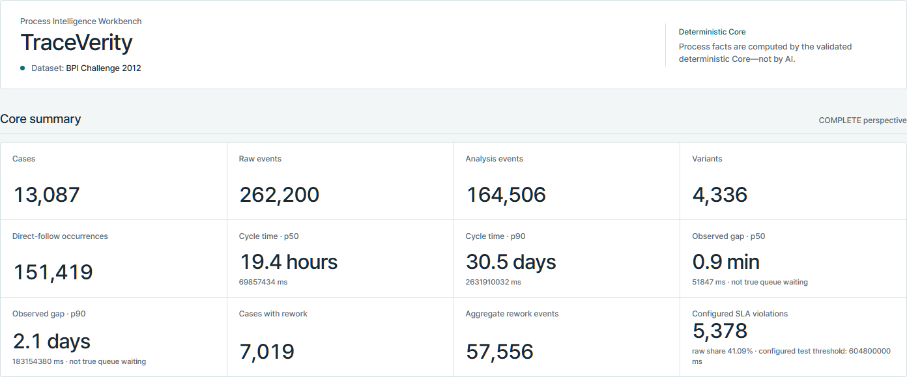
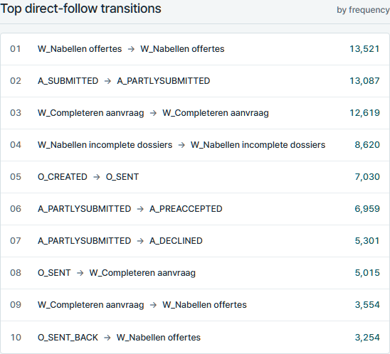
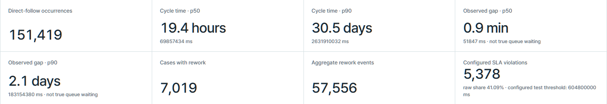

# TraceVerity — Process Intelligence Workbench

TraceVerity is a local-first Process Intelligence product that reconstructs
observed workflow behavior from event logs while keeping authoritative process
facts inside one deterministic Python/DuckDB Core.

**AI never invents process truth or numeric metrics.** The Agent and MCP path
are bounded consumers of the same five read-only Core tools used by the product
contracts; Web and Power BI consume deterministic facts rather than redefining
the metrics.



## What it demonstrates

- Deterministic XES ingest, canonical event ordering, DuckDB persistence, and
  process metrics under a versioned contract.
- Analyst-facing React/TypeScript workbench over a localhost FastAPI surface.
- Deterministic analytics export consumed by Power Query and thin DAX measures
  for a locally verified Power BI Desktop report.
- One bounded local Agent with provenance-backed facts and explicit abstention.
- A stdio MCP route exposing the **same** five read-only Core tools rather than
  a second truth layer.
- Machine regression, browser E2E, route-equivalence checks, and a supervised
  usability gate with deliberately scoped public evidence.

## Trust architecture

```text
BPI Challenge 2012 XES
        |
        v
deterministic Python / DuckDB Core
        |
        +--> five typed read-only tools --> direct local Agent
        |                             \--> stdio MCP --> same tools
        |
        +--> FastAPI --> React workbench
        |
        +--> deterministic CSV export --> Power Query / DAX --> Power BI Desktop
```

The Core pins the source fingerprint and validates 17 invariants. Invalid source
or metric state produces `HOLD`. Agent answers must be grounded in exact returned
facts; unsupported requests end as `UNAVAILABLE`. See
[docs/ARCHITECTURE.md](docs/ARCHITECTURE.md) and
[docs/CONTRACTS.md](docs/CONTRACTS.md).

## Demonstrated BPIC12 facts

The canonical source is **BPI Challenge 2012**, a loan-application event log.
The source archive is not included in this repository.

| Aggregate fact | Verified value |
|---|---:|
| Cases | 13,087 |
| Raw events | 262,200 |
| COMPLETE-perspective analysis events | 164,506 |
| Variants | 4,336 |
| Direct-follow occurrences | 151,419 |
| Cases with rework | 7,019 |
| Aggregate rework events | 57,556 |
| Configured-scenario SLA violations | 5,378 cases (41.09%) |

Two semantic boundaries are important:

- **Observed event gap is not true queue waiting.** It is the timestamp delta
  between adjacent COMPLETE-perspective events.
- **604,800,000 ms (7 days) is a configured test threshold, not a claimed
  BPIC12 business SLA.**



## Verification

The curated public record is
[`evidence/public-verification-summary.json`](evidence/public-verification-summary.json).
Current verified highlights:

| Check | Result |
|---|---:|
| Python regression | 48 passed |
| Web production build | PASS |
| Playwright | 1/1 PASS |
| Direct Agent evaluation | 10/10 PASS |
| MCP-route evaluation | 10/10 PASS |
| Grounding violations | 0 |
| Forbidden actions / attempts | 0 / 0 |
| Power BI local refresh + reopen validation | PASS |
| Supervised usability | 3 valid humans × 3/3 tasks PASS |

The usability result belongs to the Korean-localized test-only surface at the
exact tested revision documented in [docs/USABILITY.md](docs/USABILITY.md).
English copy and the later visual polish in these screenshots were not the
tested surface.



## Local reproduction

TraceVerity does not auto-download or redistribute BPIC12. Obtain the dataset
from the official source and verify the pinned SHA-256 before running the Core.
The checked reproduction sequence is documented in
[docs/REPRODUCTION.md](docs/REPRODUCTION.md).

Quick baseline:

```powershell
uv sync --extra test
uv run piw-slice0
uv run pytest

Set-Location web
npm ci
npm run build
npm run test:e2e
```

The public tree reproduces the deterministic Core, Python/MCP contract tests,
Web build/E2E, and analytics export. The historical full Slice 5 model-based
evaluator additionally protects exact local Slice 0–4 evidence and the PBIX by
hash; because those private/local artifacts are intentionally excluded, that
full evaluator belongs to the canonical verification workspace rather than the
sanitized public tree. Its aggregate 10/10 direct and 10/10 MCP results are
published in the curated verification summary.

## Repository layout

```text
src/piw/                 deterministic Core, tool surface, Agent, Web API, MCP
tests/                   Core/API/export/MCP regression coverage
web/                     React/TypeScript workbench + focused Playwright proof
evaluation/              fixed Agent/MCP evaluation cases
analytics/powerbi/       deterministic export manifest, Power Query, DAX
evidence/                aggregate-only public verification summary
docs/                    architecture, contracts, reproduction, usability summary
```

## Data rights and licence

Project-authored source and documentation in this distribution are licensed
under the [MIT License](LICENSE).

**BPI Challenge 2012 is separate.** It was created by Boudewijn van Dongen and
is available through 4TU.ResearchData / Eindhoven University of Technology at
DOI `10.4121/uuid:3926db30-f712-4394-aebc-75976070e91f`. The official dataset
metadata identifies the licence as **4TU General Terms of Use**. The source
archive is not bundled and is not relicensed by this project. See [NOTICE](NOTICE).

## v1 scope

TraceVerity v1 is intentionally local-first. It does **not** claim generic
event-log import, process maps, predictive process mining, authentication,
multi-agent/A2A behavior, auto-remediation, cloud infrastructure, or SaaS
operation. The Agent and MCP work are integration/trust proofs around the
deterministic Process Intelligence product, not the product identity itself.
