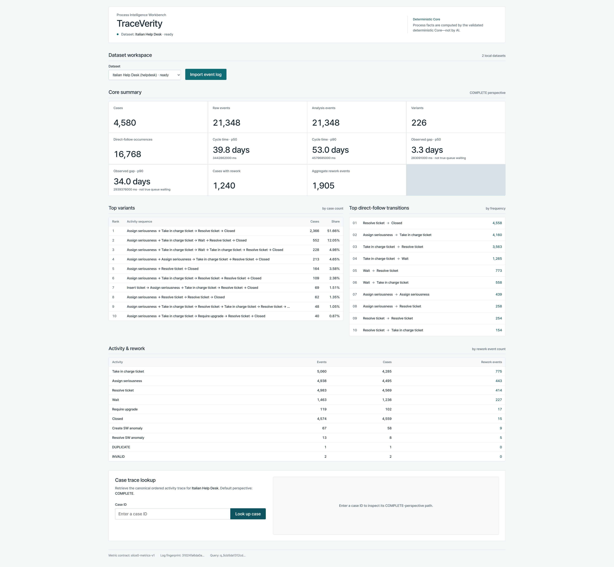

# TraceVerity — Process Intelligence Workbench

TraceVerity is a local-first Process Intelligence workbench that imports, maps, validates, and analyzes CSV, XES, and XES.GZ event logs through one deterministic Python/DuckDB Core proven across two real business processes.

**AI never defines authoritative process metrics.** The browser, Direct Agent, and stdio MCP resolve datasets through the same Core-backed read path. The historical Power BI proof consumes a deterministic BPIC12 export rather than independently defining process metrics.


## One process-truth boundary

Event-log results drift when each UI, BI layer, or model calculates them independently. TraceVerity keeps ordering, lifecycle perspective, variants, direct-follow counts, durations, rework, and configured-threshold semantics in one versioned Core. Invalid sources and inconsistent local state fail closed.

```text
local CSV / XES / XES.GZ
        |
        v
explicit preview, mapping, timestamp interpretation, validation
        |
        v
DatasetRegistry -> DatasetResolver -> CoreReadSurface
        |                         deterministic Python / DuckDB Core
        +--> localhost FastAPI --> React workbench
        +--> 5 read-only tools --> Direct Agent
        |                       \-> stdio MCP
        \--> BPIC12 export ------> historical Power BI proof
```

Current contracts:

- metrics: `slice0-metrics-v1`
- generic import: `dataset-import-v1`
- HTTP: `slice-c-http-v2`
- tool schema: `slice-d-tool-v2`
- analytics export: `slice3-powerbi-export-v1`

## Browser onboarding

The Dataset Workspace supports local `.csv`, `.xes`, and `.xes.gz` files. A user previews source identity, maps CSV fields explicitly, states timestamp format/timezone interpretation, validates the source, and only then registers a ready dataset. The workbench can switch between registered datasets without changing the Core semantics.



For CSV, case ID, activity, and timestamp mappings are required. Resource and lifecycle are explicit optional mappings. A supplied timezone is a deterministic normalization convention, not automatically a claim about the source's real-world timezone.

## Two real-world dataset proof

The same unchanged metric engine was independently re-derived against two real event logs.

| Verified aggregate | BPI Challenge 2012 | Italian Help Desk |
|---|---:|---:|
| Cases | 13,087 | 4,580 |
| Raw events | 262,200 | 21,348 |
| Analysis events | 164,506 | 21,348 |
| Activities | 24 | 14 |
| Variants | 4,336 | 226 |
| Direct-follow occurrences | 151,419 | 16,768 |
| Cases with rework | 7,019 | 1,240 |
| Aggregate rework events | 57,556 | 1,905 |

Neither raw dataset is bundled. Source identity, fingerprints, attribution, and aggregate facts are in [`evidence/public-verification-summary.json`](evidence/public-verification-summary.json).


## Shared Web, Agent, and MCP facts

The public tool surface has exactly five read-only operations:

- `describe_log`
- `list_variants`
- `list_transitions`
- `list_activities`
- `get_case_trace`

Direct Agent and stdio MCP use the same schemas, `DatasetResolver`, and `CoreReadSurface`; MCP is a transport, not a second metric engine. Agent answers are accepted only when values trace to returned facts. Unsupported requests remain unavailable rather than being estimated.

## Verification

Independent Recovery Slice E verification on canonical baseline `f4da118f7f8f8df9beedf0c8b00e1f9bc14fb535` recorded:

| Gate | Result |
|---|---:|
| Python regression | 190 / 190 PASS |
| Web production build | PASS |
| Playwright | 2 / 2 PASS |
| Direct Agent | 12 / 12 PASS |
| MCP Agent | 12 / 12 PASS |
| Direct/MCP comparisons | 22 / 22, mismatch 0 |
| Grounding / forbidden-action violations | 0 / 0 |
| Machine-path scan | 179 responses, 0 leaks |

The canonical Slice E report SHA-256 is `a94219d0f6fbdb55082065162e72881ed1efd4e8b96d25a528564e04e9fa0e5a`. The aggregate-only public record uses schema `traceverity-public-verification-v2`.

The sanitized public tree passes **168 / 168 Python tests**. It intentionally excludes canonical-only Help Desk evidence integration, model-backed Agent/MCP re-derivation, protected-artifact/PBIX regression, and historical evidence checks. The independent Slice E 190/190 result remains published aggregate evidence; it is not represented as the public-tree test count. Details: [`docs/REPRODUCTION.md`](docs/REPRODUCTION.md).

## Local reproduction

```powershell
uv sync --extra test
uv run piw-slice0
uv run pytest -q

Set-Location web
npm ci
npm run build
npm run test:e2e
```

The sources must be obtained separately. Full BPIC12 baseline, generic browser onboarding, optional real Help Desk reproduction, Agent/MCP checks, and the historical Power BI path are separated in [`docs/REPRODUCTION.md`](docs/REPRODUCTION.md).

## Boundaries

- Local-first single-user workbench; no cloud/SaaS, authentication, multi-user, or enterprise-scale claim.
- Generic browser/Core/Agent/MCP support covers registered datasets. Power BI remains a historical BPIC12-specific proof, not generic Power BI.
- No predictive process mining or BPMN/Petri-net discovery claim.
- Observed event gap is **not** true queue or waiting time.
- Configured thresholds are analytical scenarios, **not** actual business SLAs. Help Desk has no default configured threshold.
- Historical analysis-UI usability passed with three valid humans at revision `29352c5f47af94fefc04f920e35002bc16b71168`. Current browser onboarding has **not** completed a human usability cohort.


## Data rights and licence

Project-authored source and documentation in this distribution are licensed under the [MIT License](LICENSE).

BPI Challenge 2012 and the Italian Help Desk dataset remain under their own source terms. They are not bundled and are not relicensed by this repository. See [NOTICE](NOTICE) and [`docs/REPRODUCTION.md`](docs/REPRODUCTION.md).
